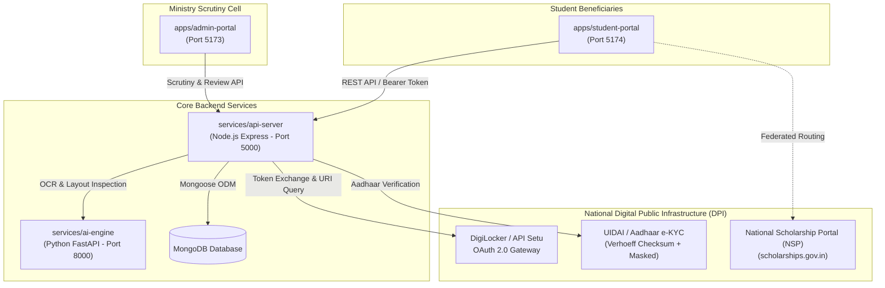
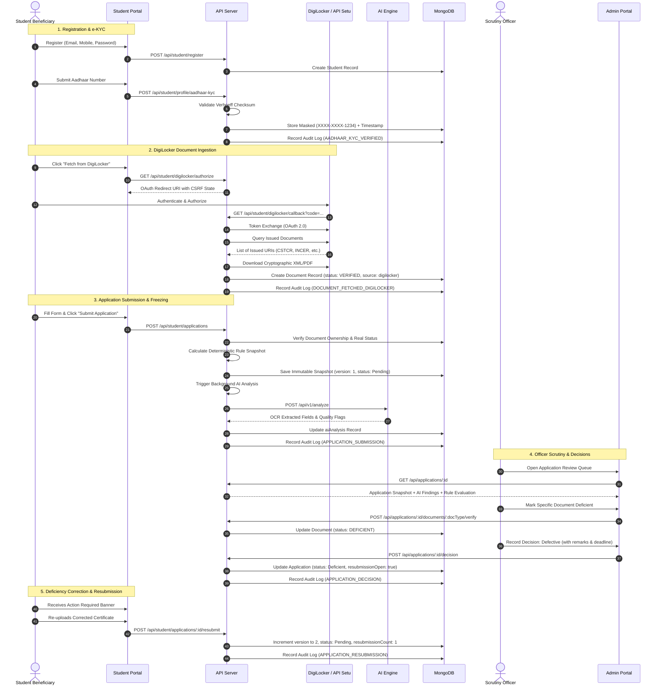

# Ministry of Tribal Affairs (MoTA) - TribeXcel Platform Architecture

## 1. System Overview

**TribeXcel** is the AI-enabled Scholarship and Fellowship Management System engineered for the **Ministry of Tribal Affairs (MoTA), Government of India**. The platform digitizes and unifies the complete beneficiary journey—from registration, Aadhaar-based e-KYC, and DigiLocker document retrieval to deterministic rule evaluation, AI-assisted document quality inspection, nodal officer scrutiny, and DBT-ready merit generation.

---

## 2. Monorepo Organization

```
TribeXcel/
├── apps/
│   ├── student-portal/       # Vite + React student web application (Port 5174)
│   └── admin-portal/         # Vite + React scrutiny officer dashboard (Port 5173)
├── services/
│   ├── api-server/           # Node.js Express REST API & MongoDB Data Store (Port 5000)
│   └── ai-engine/            # Python FastAPI Document OCR & Intelligence (Port 8000)
├── packages/
│   └── scheme-config/        # Canonical single-source-of-truth scheme configuration
├── docs/                     # Production architecture, security, and scheme documentation
├── scripts/                  # Seed scripts, migration utilities, and deployment helpers
├── package.json              # NPM Workspaces monorepo manifest
├── start-all.ps1             # PowerShell orchestrator
├── start-all.bat             # Batch orchestrator
└── seed-all.bat              # Database seeder script
```

---

## 3. High-Level Architecture Diagram



---

## 4. End-to-End Application Lifecycle



---

## 5. Security & Data Integrity Principles

1. **Authoritative Backend Document Model:**
   - The frontend never dictates document verification status.
   - When submitting applications, the server cross-checks uploaded document URLs and DigiLocker URIs against the MongoDB `Document` collection owned by the student.
   - Manual uploads are initialized as `PENDING` and require official scrutiny.
   - Only documents retrieved directly from API Setu / DigiLocker obtain `VERIFIED` status upon token-verified issuance.

2. **Immutable Snapshot Versioning:**
   - Applications maintain complete historical snapshots (`v1`, `v2`, etc.).
   - Resubmission does not mutate or overwrite previous officer audits; each revision is appended to `versionHistory`.

3. **Tamper-Evident Audit Logging:**
   - Every state transition, upload, e-KYC validation, and scrutiny decision logs an immutable entry to `AuditLog` capturing:
     - `actor` (ID, model, name, role)
     - `action` (strict enum)
     - `target` (entity type and ID)
     - `clientIp` and `userAgent`
     - `timestamp` (ISO 8601 UTC)
     - `metadata` (before/after states, error details, filenames)
